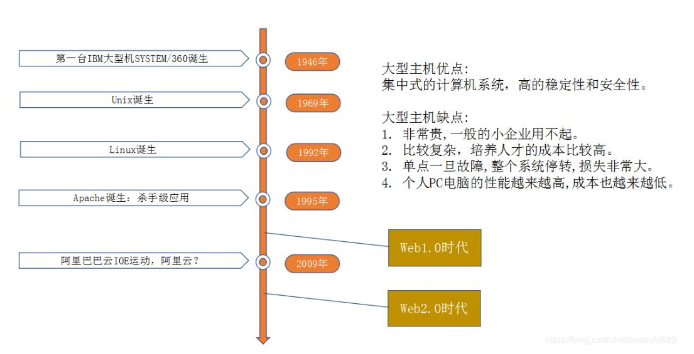

基于视频学习的关于《分布式思维》的总结，详情图片见[附件](../_data/分布式思维.pptx)

## 计算机与软件发展历史

#### web1.0时代特征
主要是单向信息的发布，即信息门户网站，互联网信息由少数人编辑人员（或站长）定制发布，例如：新浪、网易、搜狐等
#### web2.0时代特征
注重交互，每个人都是内容的发布者，例如博客，社区等

## 架构的演变
- 应用程度只获取静态文件
- 应用程序增加数据库的读取
- javaWeb的雏形
- javaWeb的集群
- javaWeb的分布式

## 前后端交互模式的演变
相应的对应架构的演变，前后端的交互的演变如下：
- 整页提交
- 页面提交+部分ajax刷新
- 首次请求返回html页面，后续请求为Restful接口，返回Jason

## 架构问题的解决方案
- 缓存（list/redis/memached）
- 横向拓展（集群负载）
- 拆分高负载服务，独立为一模块
- 大表数据切片（ mysql分库分区分表）
- 使用搜索中间件： solr/elasticsearch
- 消息队列（mq）

## 关键概念的对比及解析

### 集群VS分布式
一个横向一个纵向。集群是相同的应用部署到多个服务器上，分布式是不同的模块可以部署到不同的服务器上。
### 分布式与微服务
微服务是一种架构思想，一般以分布式实现。
来自知乎，个人比较认可的解释如下：

[从概念理解，分布式服务架构强调的是服务化以及服务的分散化，微服务则更强调服务的专业化和精细分工；从实践的角度来看，微服务架构通常是分布式服务架构，反之则未必成立。所以，选择微服务通常意味着需要解决分布式架构的各种难题](https://www.zhihu.com/question/28253777/answer/551785648 "分布式服务架构与微服务架构概念的区别与联系是怎样的？ - 网易云的回答 - 知乎")
### mvvm模式
MVVM分别指View，Model，View-Model，相对于之前的MVC，直接将View和Modal进行关联。之前MVC模式，html页面相当于View，Modal相当于JavaScript完成的工作，Controller相当于ajax数据获取的过程。MVVM模式的实现如现在我们使用的React框架和Vue框架，React就是隐藏对Modal的操作，数据操作的变化（Modal），会反馈形成页面的变化（View）。

参考文章:[MVVM框架理解及其原理实现](https://segmentfault.com/a/1190000015895017?utm_source=tag-newest "MVVM框架理解及其原理实现")
