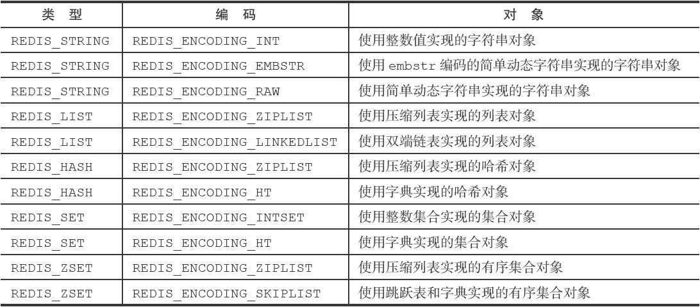

## 1. 底层数据结构

-   SDS 简单动态字符串

  ```c
   struct sdshdr {
     int len; //字符串长度，buf中已经使用的字节长度
     int free; //空闲长度，buf中未使用的字节长度
     char buf[]; //保存字符串
   }
  ```
  
  

   ***好处：1. 可以快速获取字符串长度；2.避免缓冲区溢出（根据free和当前需要分配的内存大小进 行预分配）；3.降低分配次数提升内存使用效率***


-  链表
- 字典：底层实现是哈希表（类似于java的hashmap底层实现数据结构）

​     每个字典有两个哈希表，一个平时使用，一个在rehash时使用 （对hash表的大小进行扩展和伸缩）

​     rehash时渐进式完成，不是一次性。（避免集中式庞大的计算量）

- 跳跃表

​     有序集合底层实现之一，通过在每个节点中维持多个指向其他节点的指针，从而达到快速访问节点的目的

- 整数集合

​     集合键的底层实现之一

​     特点：有个属性存储类型的编码，根据情况可以动态升级类型，不支持降级

- 压缩列表

​     列表键和哈希键的底层实现之一，为了节约内存而开发的，是由一系列特殊编码的连续内存块组成的顺序型数据结构。


Redis中每个对象都是由一个RedisObject结构表示，该结构中和保存数据有关的三个属性分别为type，encoding，ptr属性

```c
typedef struct redisObject{
  //类型
  unsigned type; //REIDS_STRING,REDIS_LIST等，常量
  //编码
  unsigned encoding; //见第二节截图，常量
  //指向底层实现数据结构的指针
  void * ptr; //.....
}
```

 

## 2. 常见的对象类型及操作命令

  Redis数据库中key只能是string，但是value可以是以下类型：

- String字符串
- Hash 哈希表
- List列表
- Set集合
- Sorted Set有序集合

  Redis会根据不同的场景选择不同的编码（即第一节中提到的集中存储数据结构），可以TYPE命令查看




项目中用到String对象，此处对String对象进行详细的总结：

字符串对象的编码方式可以是int，raw或者embstr，通过OBEJECT ENCODING key 可以查看编码类型


 存储结构都是使用redisObject和sdshdr结构

  -  如果字符串对象保存的是整数值，存储int编码
  -  如果字符串对象保存的是字符串，且长度大于32字节，存储raw编码：执行二次内存分配函数
  -  如果字符串对象保存的是短字符串，即长度小于32字节，存储embstr编码：执行一次内存分配函数分配联系的空间

    

int编码的对象保存的内容为字符串的时候，会变成rawbi

embstr编码的对象（只读）执行修改命令的时候，会变成raw编码


## 3. String对象类型补充：bit

 string对象类型中存在着类似于getbit setbit bitcount的命令，存储结构与string一致，只是使用起来像bitmap，可以用来统计，类似于实际业务场景中记录上线天数，在线人数等等应用，存储量较少。

 

## 4. 其他操作命令：sort，limit等

 sort：默认对数字进行排序，对字符串进行排序的时候需要加alpha这个参数

  

## 5. 持久化 AOF和RDB

AOF更新频率高于RDB，当开启了AOF持久化，会优先载入AOF更新数据库状态

RDB持久化通过保存数据库中的键值对来记录数据库状态不同，AOF持久化是通过保存Redis 服务器所执行的写命令来记录数据库状态的  

**RDB** 

定时生成压缩的二进制文件（RDB文件），保存在磁盘中 手动生成方式：SAVE，BGSAVE，其中SAVE是阻塞进程的，BGSAVE是另外起一个子进程去执行命令的 RDB文件里面大概存储的是key，value，校验位等信息，不同对象类型存储的方式是不同的 

 AOF（Append Only FIle） 

每执行一个命令之后，就将命令写到AOF的内存缓存区中，再每个redis的时间事件函数执行的最后，会去判断时间间隔，并将缓存的内容写到AOF文件中，其中时间间隔，可以通过配置的属性进行设置： 

appendfsync always #每次有数据发生变化时都会写入appendonly.aof 

appendfsync everysec #默认方式，每秒同步一次到appendonly.aof 

appendfsync no #不同步，数据不会持久化 随着时间积累，命令会越来越多，针对这种情况，AOF提供重写文件的功能，即历史多条命令，通过查看当前该键的值，可以转换成一条命令，例如SET key value这样的命令。新的文件会替换旧的文件。  

键过期删除的方式： 一般删除的方式有三种：定时删除：定时器删除，占用cpu多 惰性删除：有点像乐观锁的概念，当需要使用的时候判断当前键是否过期了，如果过期了再删除 定期删除：间隔一段时间进行删除 Redis是惰性删除和定期删除的结合


## 6. 事务

Redis**没有事务回滚**，是将多个命令打包，然后一次性、有序地执行的机制。 

Redis没有回滚机制的解释：

Redis的作者在事务功能的文档中解释说，不支持事务回滚是因为这种复杂的功能和 Redis追求简单高效的设计主旨不相符，并且他认为，Redis事务的执行时错误通常都是编程 错误产生的，这种错误通常只会出现在开发环境中，而很少会在实际的生产环境中出现，所 以他认为没有必要为Redis开发事务回滚功能。


## 7. 集群：复制，选举

集群高可用：Sentinel（哨岗、哨兵）是Redis的高可用性（high availability）解决方案：由一个或多个 Sentinel实例（instance）组成的Sentinel系统（system）可以监视任意多个主服务器，以及这 些主服务器属下的所有从服务器，并在被监视的主服务器进入下线状态时，自动将下线主服 务器属下的某个从服务器升级为新的主服务器，然后由新的主服务器代替已下线的主服务器 继续处理命令请求

Sentinel是一个特殊角色的redis服务器，是不当做数据库使用的，因此初始化不需要载入AOF和RDB文件；其次，开始的时候，Sentinel通过与其他服务器建立连接和发送命令来获取或监控其他服务器状态；当主服务器故障的时候，会在Sentinel内删除该服务器信息，并删除其他无效服务器的信息，从而选举出新的主服务器，最后进行故障转移（复制）。 

主服务器选举的方式：选择剩下服务器中优先级高的，如果没有优先级就选择偏移量大的服务器（偏移量最大的服务器中数据是最新的） 。

Sentinel系统选举领头Sentinel的方法是对Raft算法的领头选举方法的实现。

主备服务器之间复制SLAVEOF命令可以进行复制 复制的基本原理是：从服务器发送命令给主服务器要求复制，主服务器会执行一个BGSAVE的命令，产生RDB文件，并发送给从服务器，从服务器根据RDB文件恢复 Redis 2.8以前的复制功能不能高效地处理断线后重复制情况，但Redis 2.8新添加的部分重同步功能可以解决这个问题。


## 8. 订阅，监视器和慢日志

Redis的慢查询日志功能用于记录执行时间超过给定时长的命令请求，用户可以通过这个 功能产生的日志来监视和优化查询速度。