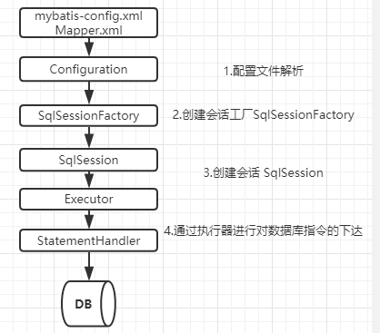

# Spring设计模式

## 1.简单工厂模式

eg：BeanFactory

```java
public interface BeanFactory {
    String FACTORY_BEAN_PREFIX = "&";

    Object getBean(String var1) throws BeansException;

    <T> T getBean(String var1, @Nullable Class<T> var2) throws BeansException;
}
```


以getBean（String var1）方法为例，通过参数产生不同的Bean


## 2. 工厂模式

eg：FactoryBean

```java
public interface FactoryBean<T> {
    @Nullable
    T getObject() throws Exception;

    @Nullable
    Class<?> getObjectType();

    default boolean isSingleton() {
        return true;
    }
}
```

以getObject()方法为例，不需要传参可以获取特定的实例


## 3. 单例模式

eg. AbstractBeanFactory（实现BeanFactory的一个类），其中doGetBean方法实现就用到单例模式，目的是获取单例的bean

```java
public abstract class AbstractBeanFactory extends FactoryBeanRegistrySupport implements ConfigurableBeanFactory {
    
        private final Map<String, Object> singletonObjects = new ConcurrentHashMap<>(256);

        protected <T> T doGetBean(String name, @Nullable Class<T> requiredType, @Nullable Object[] args, boolean typeCheckOnly) throws BeansException {
        String beanName = this.transformedBeanName(name);
        Object sharedInstance = this.getSingleton(beanName);
        Object bean;
        if (sharedInstance != null && args == null) {
            ..
        }
            
             @Nullable
    protected Object getSingleton(String beanName, boolean allowEarlyReference) {
        Object singletonObject = this.singletonObjects.get(beanName);
        if (singletonObject == null && this.isSingletonCurrentlyInCreation(beanName)) {
            synchronized(this.singletonObjects) {
                singletonObject = this.earlySingletonObjects.get(beanName);
                if (singletonObject == null && allowEarlyReference) {
                    ObjectFactory<?> singletonFactory = (ObjectFactory)this.singletonFactories.get(beanName);
                    if (singletonFactory != null) {
                        singletonObject = singletonFactory.getObject();
                        this.earlySingletonObjects.put(beanName, singletonObject);
                        this.singletonFactories.remove(beanName);
                    }
                }
            }
        }

        return singletonObject;
    }
}
```


## 4. 代理模式

代理模式就是用一个类去动态代理调用另外一个类，eg：Spring中AOP的实现，具体用一个代理类，然后选择实现cglib还是jdk动态代理

```java
@Override
public AopProxy createAopProxy(AdvisedSupport config) throws AopConfigException {
   if (config.isOptimize() || config.isProxyTargetClass() || hasNoUserSuppliedProxyInterfaces(config)) {
      Class<?> targetClass = config.getTargetClass();
      // 如果targetClass是接口类，使用JDK来生成Proxy
      if (targetClass == null) {
         throw new AopConfigException("TargetSource cannot determine target class: " +
               "Either an interface or a target is required for proxy creation.");
      }
      if (targetClass.isInterface() || Proxy.isProxyClass(targetClass)) {
         return new JdkDynamicAopProxy(config);
      }
      // 如果不是接口类，使用CGLIB生成Proxy
      return new ObjenesisCglibAopProxy(config);
   }
   else {
      return new JdkDynamicAopProxy(config);
   }
}
```


## 5.观察者模式

Spring的事件监听机制，就是通过观察者模式实现，在Spring启动的时候会启动SpringApplicationRunListener。

Spring监听机制的实现见文章：

[spring监听机制——观察者模式的应用]: http://www.manongjc.com/article/105839.html	"spring监听机制——观察者模式的应用"


## 6.模板模式

事务管理中，抽象模板方法：AbstractPlatformTransactionManager，该方法中实现一些方法，然后对外暴露一些模板方法：

```java
public abstract class AbstractPlatformTransactionManager implements PlatformTransactionManager, Serializable {
...
    protected abstract Object doGetTransaction() throws TransactionException;
    protected abstract void doBegin(Object var1, TransactionDefinition var2) throws TransactionException;
    protected abstract void doCommit(DefaultTransactionStatus var1) throws TransactionException;
    protected abstract void doRollback(DefaultTransactionStatus var1) throws TransactionException;
...
}
```


## 7. 适配器模式

eg: Spring中**Adapter** 后缀方法，典型的是Spring AOP中AdvisorAdapter的方法。

Advice（通知）的类型有：BeforeAdvice、AfterReturningAdvice、ThrowsAdvice的。

在每个类型Advice（通知）都有对应的拦截器，MethodBeforeAdviceInterceptor、AfterReturningAdviceInterceptor、ThrowsAdviceInterceptor。

Spring需要将每个Advice（通知）都封装成对应的拦截器类型，返回给容器，所以需要使用适配器模式对Advice进行转换。

```java
public interface AdvisorAdapter {
    boolean supportsAdvice(Advice advice);
	MethodInterceptor getInterceptor(Advisor advisor);
}
```

```java
class AfterReturningAdviceAdapter implements AdvisorAdapter, Serializable {
	@Override
	public boolean supportsAdvice(Advice advice) {
		return (advice instanceof AfterReturningAdvice);
	}

	@Override
	public MethodInterceptor getInterceptor(Advisor advisor) {
		AfterReturningAdvice advice = (AfterReturningAdvice) advisor.getAdvice();
		return new AfterReturningAdviceInterceptor(advice);
	}
}
```


  

## 8. 装饰器/包装器模式

Spring中用到的包装器模式在类名上有两种表现：一种是类名中含有**Wrapper**，另一种是类名中含有**Decorator**。基本上都是动态地给一个对象添加一些额外的职责。

类似产品换包装，核心没变，关于装饰器模板示例说明代码见 [装饰器模式/包装器模式](https://www.jianshu.com/p/b8c364861663)

## 9. 策略模式

Spring中**Strategy**后缀的方法，随着策略对象改变而改变的 使用的对象执行的算法。关于策略参考见[策略模式](https://www.runoob.com/design-pattern/strategy-pattern.html)


  

[^1]: Spring框架用到9个设计模式汇总：https://blog.csdn.net/zl1zl2zl3/article/details/83689539


# Mybatis设计模式

mybatis执行流程：



## 1. 构造者模式

从配置文件中读取内容，进行文件解析转换成configuration，这个过程用到构造者模式，eg：**XMLConfigBuilder**

## 2. 工厂模式

SqlSession作为mybatis的核心接口，用来管理事务，执行sql等操作，而SqlSession是通过**SqlSessionFactory**构造的。

## 3.单例模式

在Mybatis中有两个地方用到单例模式，**ErrorContext**和 **LogFactory**，其中ErrorContext是用在每个线程范围内的单例，用于记录该线程的执行环境错误信息，而LogFactory则是提供给整个Mybatis使用的日志工厂，用于获得针对项目配置好的日志对象。

```java
public class  ErrorContext  {
        private  static  final  ThreadLocal<ErrorContext>  LOCAL  =  new  ThreadLocal<ErrorContext>();
        private  ErrorContext()  {
        } 
        public  static  ErrorContext  instance()  {
                ErrorContext  context  =  LOCAL.get();
                if  (context  ==  null)  {
                        context  =  new  ErrorContext();
                        LOCAL.set(context);
                }
                return  context;
        }
}
```

## 4. 代理模式

在写mapper的接口的时候，mybatis的实现是利用动态代理的方法，底层是jdk的动态代理（ Proxy.newProxyInstance）

```java
/**
  *  @author  Lasse  Voss
  */
public  class  MapperProxyFactory<T>  {
 
        private  final  Class<T>  mapperInterface;
        private  final  Map<Method,  MapperMethod>  methodCache  =  new  ConcurrentHashMap<Method,  MapperMethod>();
 
        public  MapperProxyFactory(Class<T>  mapperInterface)  {
                this.mapperInterface  =  mapperInterface;
        }
 
        public  Class<T>  getMapperInterface()  {
                return  mapperInterface;
        }
 
        public  Map<Method,  MapperMethod>  getMethodCache()  {
                return  methodCache;
        }
 
        @SuppressWarnings("unchecked")
        protected  T  newInstance(MapperProxy<T>  mapperProxy)  {
                return  (T)  Proxy.newProxyInstance(mapperInterface.getClassLoader(),  new  Class[]  {  mapperInterface  },
                                mapperProxy);
        }
 
        public  T  newInstance(SqlSession  sqlSession)  {
                final  MapperProxy<T>  mapperProxy  =  new  MapperProxy<T>(sqlSession,  mapperInterface,  methodCache);
                return  newInstance(mapperProxy);
        }
 
}
```

```java
public  class  MapperProxy<T>  implements  InvocationHandler,  Serializable  {
 
        @Override
        public  Object  invoke(Object  proxy,  Method  method,  Object[]  args)  throws  Throwable  {
           try  {
                        if  (Object.class.equals(method.getDeclaringClass()))  {
                                return  method.invoke(this,  args);
                        }  else  if  (isDefaultMethod(method))  {
                                return  invokeDefaultMethod(proxy,  method,  args);
                        }
                }  catch  (Throwable  t)  {
                        throw  ExceptionUtil.unwrapThrowable(t);
                }
                final  MapperMethod  mapperMethod  =  cachedMapperMethod(method);
                return  mapperMethod.execute(sqlSession,  args);
        }
    }
```


## 5. 组合模式

组合模式（Composite Pattern），又叫部分整体模式，是用于把一组相似的对象当作一个单一的对象。组合模式依据树形结构来组合对象，用来表示部分以及整体层次。

在日常工作项目中，其实我们也用到这种设计模式，例如在表示部门的组织机构的时候，就是采用的这种设计模式。

在mybatis中xml文件中不同标签，对应生成不同的sql语言，就是抽象成SqlNode节点，然后解析的时候递归判断。

```java
@Override
public  boolean  apply(DynamicContext  context)  {
        if  (evaluator.evaluateBoolean(test,  context.getBindings()))  {
                contents.apply(context);
                return  true;
        }
        return false;
}  
```

## 6. 模板模式

mybatis中BaseExecutor就是模板方法，不同的类例如SimpleExecutor，ReuseExecutor等会具体实现其中的抽象方法。

```java
public abstract class BaseExecutor implements Executor {
  protected abstract int doUpdate(MappedStatement ms, Object parameter) throws SQLException;

  protected abstract List<BatchResult> doFlushStatements(boolean isRollback) throws SQLException;

  protected abstract <E> List<E> doQuery(MappedStatement ms, Object parameter, RowBounds rowBounds, ResultHandler resultHandler, BoundSql boundSql)
      throws SQLException;
      ...
}
```


## 7. 装饰器模式

一级缓存在SqlSession中，跟SqlSession生命周期一致。装饰器模式则是实现二级缓存那些类，例如PerpetualCache。

## 8. 迭代器模式

eg：Mybatis的**PropertyTokenizer**是property包中的重量级类。

```java
public  class  PropertyTokenizer  implements  Iterator<PropertyTokenizer>  {
        private  String  name;
        private  String  indexedName;
        private  String  index;
        private  String  children;
 
        public  PropertyTokenizer(String  fullname)  {
                int  delim  =  fullname.indexOf('.');
                if  (delim  >  -1)  {
                        name  =  fullname.substring(0,  delim);
                        children  =  fullname.substring(delim  +  1);
                }  else  {
                        name  =  fullname;
                        children  =  null;
                }
                indexedName  =  name;
                delim  =  name.indexOf('[');
                if  (delim  >  -1)  {
                        index  =  name.substring(delim  +  1,  name.length()  -  1);
                        name  =  name.substring(0,  delim);
                }
        }
 
        public  String  getName()  {
                return  name;
        }
 
        public  String  getIndex()  {
                return  index;
        }
 
        public  String  getIndexedName()  {
                return  indexedName;
        }
 
        public  String  getChildren()  {
                return  children;
        }
 
        @Override
        public  boolean  hasNext()  {
                return  children  !=  null;
        }
 
        @Override
        public  PropertyTokenizer  next()  {
                return  new  PropertyTokenizer(children);
        }
 
        @Override
        public  void  remove()  {
                throw  new  UnsupportedOperationException(
                                "Remove  is  not  supported,  as  it  has  no  meaning  in  the  context  of  properties.");
        }
}
```


[^1]: MyBatis中用到的设计模式: https://blog.csdn.net/star1210644725/article/details/91882685


